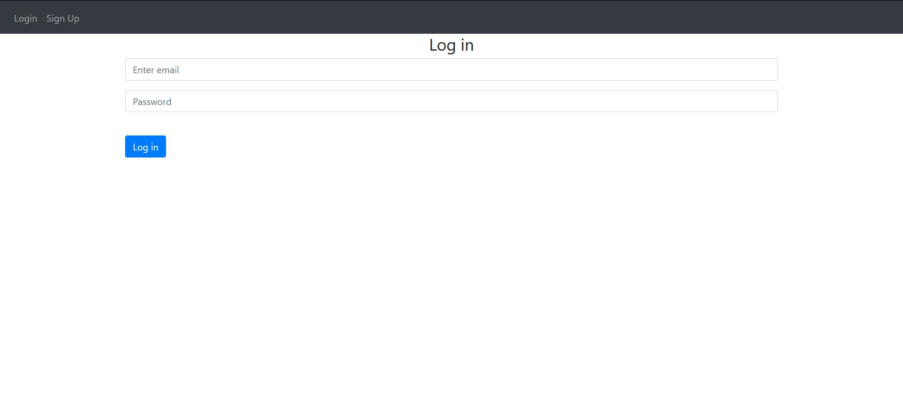
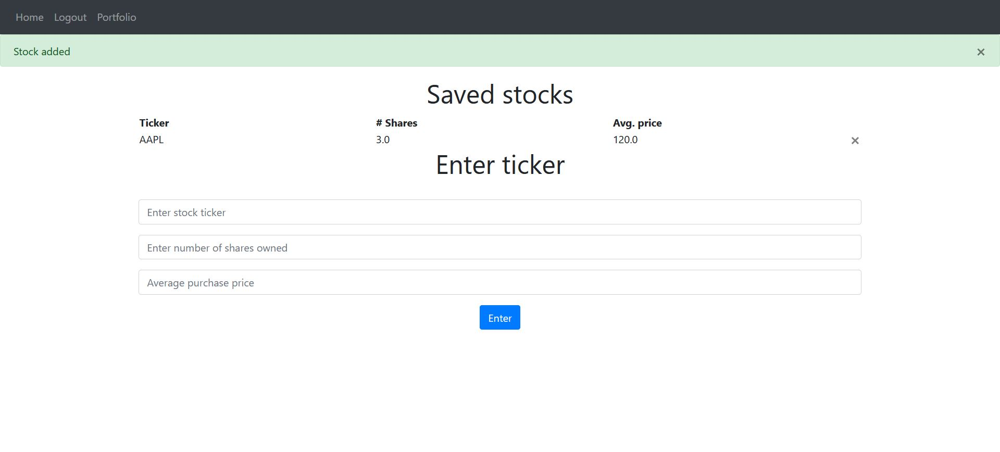
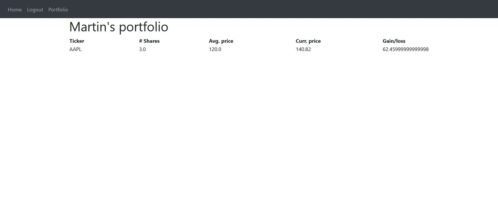

# Stock Portfolio Tracker
Online web-app that allows you to track the performance of the stocks in your portfolio.
This project is still a work in progress.

## Setup

For this website to work, you will need to create a finnhub account to get an API key for the finnhub API:
https://finnhub.io/dashboard

Uses a Flask framework, with mongoDB and SQL Alchemy for backend.

## Usage

Website will first require you to create an account:

After creating an account, you can add stocks, and their purchase price to your portfolio:

And using the portfolio tab, the website will call the API to get the last close price for the uploaded stock:

